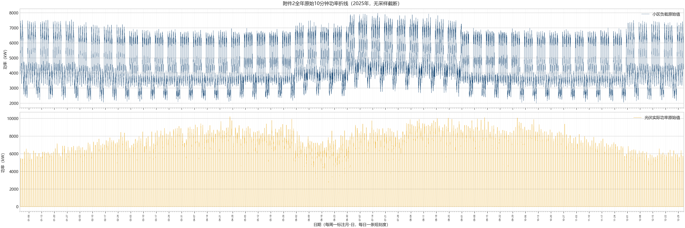
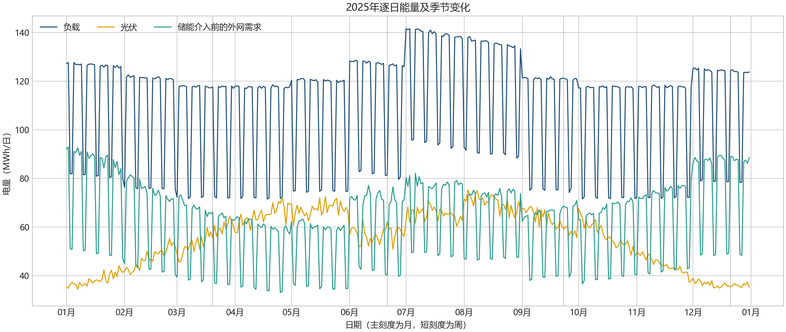
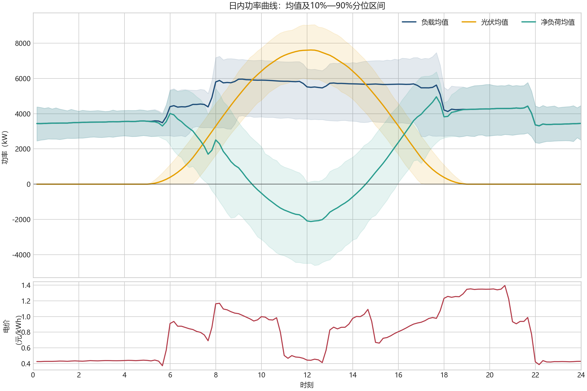
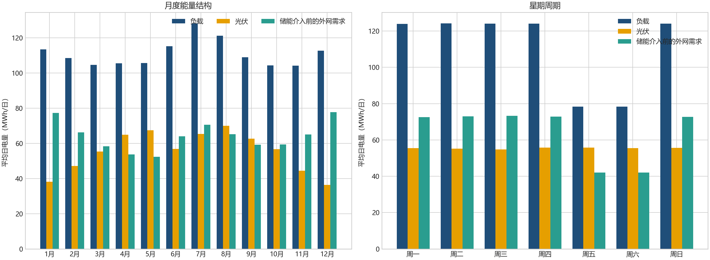
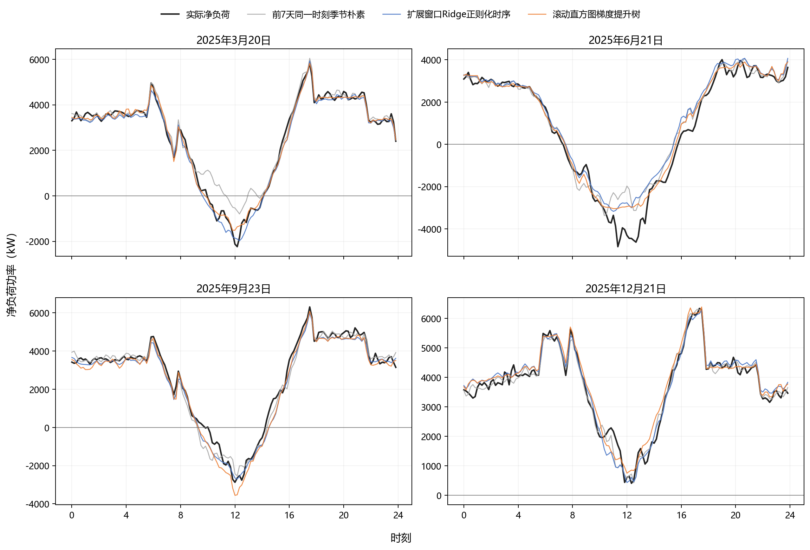
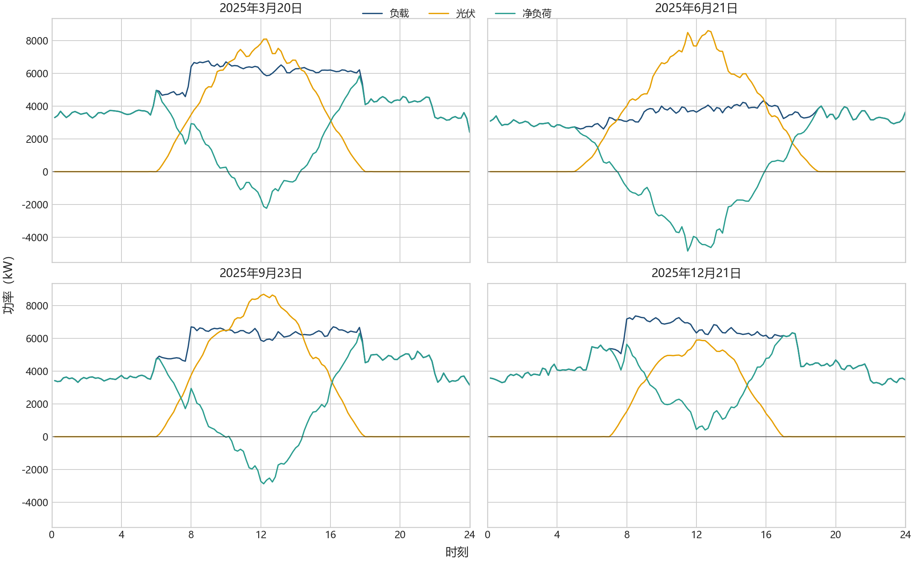

# C 题问题二：数据规律分析

> 分析对象：附件 1 的固定日内电价、附件 2 的 2025 年小区负载与光伏实际功率，以及附件 5 的 `result2.xlsx` 输出结构。描述性统计复现脚本为 [`program/2/analyze_data_q2.py`](../../program/2/analyze_data_q2.py)，严格因果预测比较由 [`program/2/compare_q2_methods.py`](../../program/2/compare_q2_methods.py) 生成。

## 1. 主要规律

1. 附件 2 的负载与光伏均为 365 天 × 144 个 10 分钟时点，各含 52,560 个观测；日期连续，且无缺失、非有限值、负值或重复日期。
2. 负载存在很强的 7 天周期：周五、周六平均日负荷为 78.37 MWh，其余星期为 124.04 MWh；相隔 7 日的负载日曲线相关系数为 0.9855，明显高于相隔 1 日的 0.6792。
3. 光伏同时具有稳定日内钟形与季节变化：日曲线相隔 1 日和 7 日的相关系数分别为 0.9923、0.9903；平均峰值 7.612 MW，出现在 12:10；月均日电量由 12 月的 36.3 MWh 增至 8 月的 70.0 MWh。
4. 净负荷呈明显“鸭形”：平均谷值为 -2.118 MW（12:10），平均峰值为 4.956 MW（17:40）。这说明日内储能搬移具有稳定的数据基础。
5. 日内电价峰谷差显著：最低价 0.3713 元/kWh，最高价 1.3952 元/kWh，峰谷比 3.7576；高于充、放电效率均为 90% 时的往返套利阈值 $1/0.9^2=1.2346$。
6. 光伏富余与储能边界重合频繁：全年 330 天出现光伏大于负载；109 天的原始日富余超过 9.6 MWh 可用 SOC 摆幅，241 个时段的富余功率超过 5 MW。
7. 严格滚动回测中，扩展窗口 Ridge 的净负荷 MAE 为 261.81 kW，优于 7 日周期预测的 327.77 kW 和滚动树模型的 290.22 kW；这与最终决策层选中 Ridge 残差场景法相互吻合。

## 2. 数据与信息边界

| 文件/工作表 | 数据规模 | 内容 | 在问题二中的角色 |
|---|---:|---|---|
| 附件 1 / `Sheet1` | 144 行 | 时间、电价、单日负载与光伏预测 | 只取固定的 144 点日内电价 |
| 附件 2 / `小区负载` | 365 × 144 | 2025-01-01 至 2025-12-31 实际负载 | 历史学习数据与事后回测真值 |
| 附件 2 / `光伏发电实际功率` | 365 × 144 | 同期实际光伏功率 | 历史学习数据与事后回测真值 |
| 附件 5 / `result2.xlsx` | 334 个输出日 | 计划购电、充放电、SOC、紧急购电 | 输出期为 2025-02-01 至 2025-12-31 |

每个功率点代表 10 分钟。取 $\Delta t=1/6$ h，功率转为区间电量：

$$
E_{d,t}=P_{d,t}\Delta t=P_{d,t}/6\;(\mathrm{kWh}).
$$

附件 2 与 `result2.xlsx` 对应同一条实际运行轨迹，因此评价数据是固定的；但制定第 $d$ 日计划时，当天的实际负载和光伏尚未发生。严格的信息集为

$$
\mathcal H_{d-1}=\{\text{附件 2 中第 }d\text{ 日 0:00 以前已经观测的数据}\}.
$$

一月的 31 天只用作预测与残差场景的热启动历史；从 2 月 1 日开始，全天计划购电先锁定，再用当天实际数据模拟储能补救和紧急购电。这里没有引入天气、随机生成曲线或任何附件以外的数据。

## 3. 数据质量与时间标签

| 检查项 | 结果 |
|---|---:|
| 日期范围 | 2025-01-01 至 2025-12-31，连续 365 天 |
| 每日时点数 | 144，严格每 10 分钟一个 |
| 缺失或非有限值 | 0 |
| 负载、光伏负值 | 0 |
| 重复日期/完全重复日曲线 | 均为 0 |
| 光伏精确为 0 | 44.787%，主要为夜间 |
| $0<G<1$ kW 的微小光伏 | 1,969 点，全年合计仅 40.88 kWh |
| 电价与负载、光伏时点 | 三者按列完全一致 |

源数据列标签为 `00:10, 00:20, ..., 0:00+1`，结果模板区间标签为 `0:10-0:20, ..., 0:00-0:10+1`。二者均有 144 列，输入的负载、光伏和电价内部对齐；最终结果按模板原有列序写入，未自行改变模板结构。

## 4. 附件 2 全量直接映射

下图逐点绘制附件 2 的全年负载和光伏，两条序列各包含全部 52,560 个原始点，没有采样、聚合或截断。横轴覆盖完整年度，每周一显示日期，每日保留短刻度。



全年负载中每周重复的两条低值带对应周五、周六；光伏上包络由冬季向春夏升高、展宽，再向冬季下降、收窄。

## 5. 能量规模与日内规律

### 5.1 全年及输出期规模

| 指标 | 全年 | 2 月 1 日至 12 月 31 日 |
|---|---:|---:|
| 负荷电量 | 40,524.05 MWh | 37,008.08 MWh |
| 光伏电量 | 20,251.24 MWh | 19,068.89 MWh |
| 储能介入前正净负荷 | 23,393.03 MWh | 20,997.35 MWh |
| 储能介入前光伏富余 | 3,120.22 MWh | 3,058.16 MWh |

全年光伏发电量相当于负荷电量的 49.97%；在不计储能时，光伏直接覆盖负荷的比例为 42.27%，光伏自消纳率为 84.59%。



### 5.2 功率与日内形态

| 变量 | 均值 | 标准差 | 最小值 | 95% 分位 | 最大值 |
|---|---:|---:|---:|---:|---:|
| 小区负载 | 4.626 MW | 1.412 MW | 1.996 MW | 6.916 MW | 7.979 MW |
| 光伏 | 2.312 MW | 2.949 MW | 0 | 7.956 MW | 10.216 MW |
| 净负荷 | 2.314 MW | 2.433 MW | -6.602 MW | 5.278 MW | 6.688 MW |

- 平均负载峰值为 5.959 MW（09:10），谷值为 3.309 MW（22:10）。
- 光伏大于 10 kW 的中位起止时刻约为 06:10 和 17:50，平均峰值在 12:10。
- 平均净负荷与电价的相关系数仅为 0.0933；净负荷物理峰值与最高电价时段并不完全重合。



## 6. 周内与季节规律

| 星期 | 平均负荷 | 平均光伏 | 正净负荷 |
|---|---:|---:|---:|
| 周一 | 123.90 MWh/日 | 55.56 MWh/日 | 72.60 MWh/日 |
| 周二 | 124.14 MWh/日 | 55.28 MWh/日 | 73.04 MWh/日 |
| 周三 | 124.12 MWh/日 | 54.85 MWh/日 | 73.23 MWh/日 |
| 周四 | 124.03 MWh/日 | 55.73 MWh/日 | 72.82 MWh/日 |
| 周五 | 78.33 MWh/日 | 55.85 MWh/日 | 42.01 MWh/日 |
| 周六 | 78.41 MWh/日 | 55.52 MWh/日 | 42.07 MWh/日 |
| 周日 | 123.99 MWh/日 | 55.60 MWh/日 | 72.70 MWh/日 |

周五、周六构成低负荷日型，周日恢复至高负荷平台；这一非通常周型使“前 7 天同一时刻”和星期特征成为重要的历史信号。月度上，7 月负荷最高，8 月光伏最高，12 月光伏最低且正净负荷最高。



## 7. 严格因果预测对比

所有误差均按 2025-02-01 至 2025-12-31 的逐日滚动预测计算；预测第 $d$ 日时不使用第 $d$ 日及其后的实际值。

| 方法 | 负载 MAE | 光伏 MAE | 净负荷 MAE | 净负荷 RMSE |
|---|---:|---:|---:|---:|
| 前 7 天同一时刻 | 176.80 kW | 214.69 kW | 327.77 kW | 486.47 kW |
| 扩展窗口 Ridge | **166.02 kW** | **161.64 kW** | **261.81 kW** | **371.79 kW** |
| 滚动直方图梯度提升树 | 166.81 kW | 181.58 kW | 290.22 kW | 425.04 kW |

Ridge 在负载、光伏和净负荷三组 MAE 上均最低。树模型虽能表达非线性，但附件未提供天气等解释变量，在当前有限历史窗口中并未超过正则化时序回归。预测精度只反映点预测质量，最终方法仍需在储能与紧急购电结算中比较总费用。


四个指定日期的预测与实际曲线如下，其中实际曲线只用于事后对照。



## 8. 电价与储能数据尺度

| 指标 | 数值 |
|---|---:|
| 最低/最高电价 | 0.3713 / 1.3952 元/kWh |
| 峰谷比 | 3.7576 |
| 最低连续 1 小时均价窗口 | 22:00-22:50，0.4177 元/kWh |
| 最高连续 1 小时均价窗口 | 19:50-20:40，1.3552 元/kWh |
| 允许 SOC 区间 | 1,200-10,800 kWh |
| 可用 SOC 摆幅 | 9,600 kWh |
| 每 10 分钟最大充/放电量 | 833.33 kWh |
| 最大单日原始光伏富余 | 33.416 MWh（4 月 26 日） |
| 正净负荷超过 5 MW | 3,458 个时段，占 6.579% |
| 最大 10 分钟净负荷变化 | 1,559.96 kW（6 月 19 日 17:50-18:00） |

最大单日富余量为一次可用 SOC 摆幅的 3.48 倍，说明容量约束会实际起作用；净负荷峰值与最高价窗口约相差 2 小时，说明储能既承担光伏转移，也承担分时电价搬移。

## 9. 四个指定日期的实际数据特征

本节只描述实际负载与光伏，不包含任何事前计划结果。

| 日期 | 周型 | 负荷 | 光伏 | 正净负荷 | 光伏富余 | 峰值净负荷 | 最小净负荷 |
|---|---|---:|---:|---:|---:|---|---|
| 2025-03-20 | 周四 | 117.65 MWh | 55.44 MWh | 66.12 MWh | 3.91 MWh | 5.839 MW @ 17:40 | -2.235 MW @ 12:20 |
| 2025-06-21 | 周六 | 81.41 MWh | 62.07 MWh | 40.29 MWh | 20.96 MWh | 4.005 MW @ 19:10 | -4.844 MW @ 11:30 |
| 2025-09-23 | 周二 | 121.18 MWh | 59.07 MWh | 68.59 MWh | 6.48 MWh | 6.311 MW @ 17:40 | -2.875 MW @ 12:10 |
| 2025-12-21 | 周日 | 124.38 MWh | 35.34 MWh | 89.04 MWh | 0 | 6.339 MW @ 17:30 | 0.409 MW @ 12:30 |

6 月 21 日是低负荷、高光伏和大富余日；12 月 21 日全天净负荷为正。两者构成指定日期中差异最大的两类实际场景。



## 10. 可复现数据产物

- [`analysis_metrics.json`](tmp/analysis_metrics.json)：描述性统计的机器可读版本。
- [`daily_energy_summary.csv`](tmp/daily_energy_summary.csv)：逐日能量。
- [`monthly_summary.csv`](tmp/monthly_summary.csv)：月度汇总。
- [`weekday_summary.csv`](tmp/weekday_summary.csv)：星期规律。
- [`key_date_summary.csv`](tmp/key_date_summary.csv)：四个指定日期的实际特征。
- [`q2_forecast_comparison.csv`](tmp/q2_forecast_comparison.csv)：三种严格因果预测的统一回测结果。

```powershell
python -X utf8 program/2/analyze_data_q2.py
python -X utf8 program/2/compare_q2_methods.py
```
