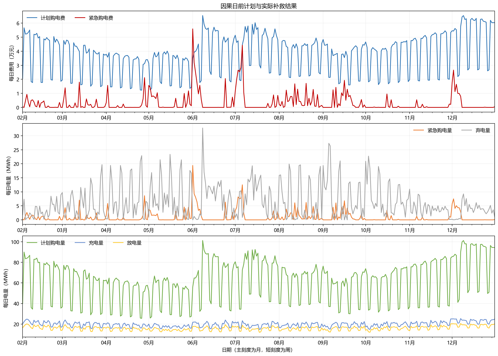
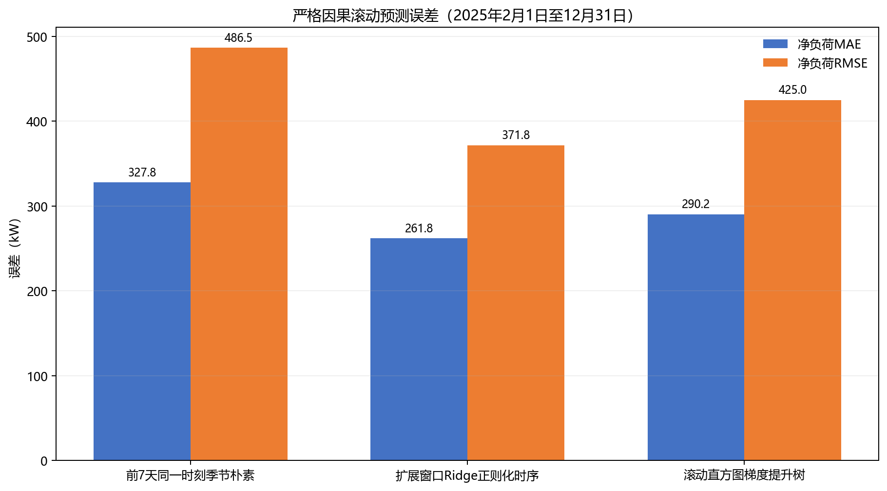
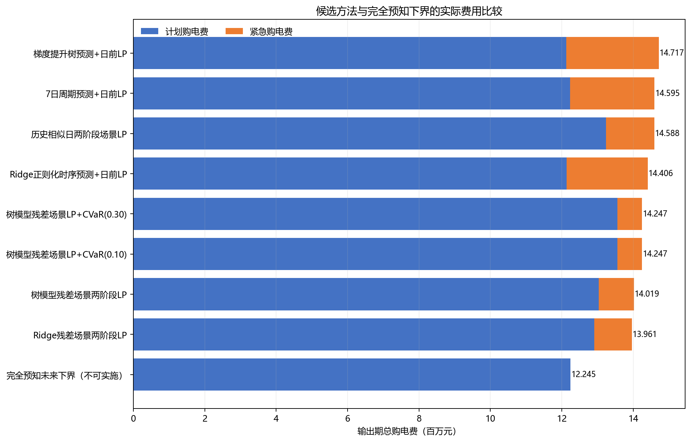
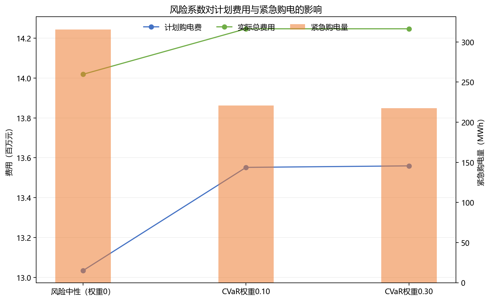

# C 题问题二：严格因果预测与两阶段场景优化

> 完整数值结果见 [`result2.xlsx`](result2.xlsx)。原始数据规律见 [`data_analysis_2.md`](data_analysis_2.md)。

## 1. 结论

按照“先保证零供电中断，再比较实际总花销”的规则，8 个可实施候选方法均实现零供电中断；其中 **Ridge 因果预测 + 历史残差场景两阶段线性规划** 的输出期实际总购电费最低，因此作为最终方案。

| 最终指标 | 数值 |
|---|---:|
| 输出日期 | 2025-02-01 至 2025-12-31，共 334 天 |
| 计划购电量 | 21,027.491 MWh |
| 紧急购电量 | 336.870 MWh |
| 计划购电费 | 12,907,867.96 元 |
| 紧急购电费 | 1,053,456.81 元 |
| **实际总购电费** | **13,961,324.77 元** |
| 供电中断次数 | **0 次** |
| 紧急购电日期 | 166 天 |
| 紧急购电 10 分钟时段 | 3,850 个 |

不可实施的“完全预知当天实际负载和光伏”理论下界为 12,245,046.92 元。最终可实施方案比该下界高 1,716,277.86 元，即 14.0161%；这部分差距反映了事前信息不完全带来的成本，而不是程序漏掉的套利空间。



## 2. 对题意与数据关系的纠正

附件 2 和 `result2.xlsx` 确实对应同一条 2025 年实际场景，所以用于最终评分的负载、光伏是固定数据。但题目要求每天 0:00 制定全天计划，此时当天 144 个实际值尚未发生。因而“数据固定”不等于“计划者事前知道数据”。

第 $d$ 日计划允许使用的信息严格限定为

$$
\mathcal H_{d-1}=\{\text{第 }d\text{ 日 0:00 以前已经观测到的附件 2 数据}\}.
$$

执行顺序为：先用 $\mathcal H_{d-1}$ 预测并构造场景，求得并锁定计划购电 $q_{d,t}$；再让第 $d$ 日实际负载与光伏进入补救仿真，得到储能调度和紧急购电 $e_{d,t}$。一月作为历史热启动，不计入 2 月 1 日至 12 月 31 日的结果期费用。

此前的变换

$$
\begin{aligned}
q'_{t}&=q_t+e_t,\\
e'_t&=0.
\end{aligned}
$$

只在事前已经知道当天真实短缺时才成立。在本题正确的信息边界下，$q_t$ 在 0:00 已锁定，发生短缺后不能把 $e_t$ 倒推回全天计划，因此最终模型不采用这一替换。

## 3. 数据来源与建模假设

本方案没有增加新的负载、光伏或天气数据。使用的全部曲线均来自附件 2；所谓“预测”“相似日”和“残差场景”只是对目标日以前附件数据的不同加工方式。

主要假设如下：

1. 每个 10 分钟功率值乘 $\Delta t=1/6$ h 转为 kWh。
2. 计划购电按附件 1 的正常分时电价结算，即使实际未全部利用也不退款；多余计划电以弃置量闭合能量平衡，不向外网售电。
3. 紧急购电只补足实时负荷，不用于给储能充电，价格为相同时段正常电价的 5 倍。
4. 充电效率和放电效率均取 0.9；SOC 范围为 1,200–10,800 kWh，最大充放电功率为 5,000 kW。
5. 问题二没有再次明文规定日首、日末 SOC 相同。为避免单日模型在 24:00 前无代价放空，并使每天方案可比，本文明确采用附加假设 $E_{d,0}=E_{d,144}=6000$ kWh。该条件属于模型边界，不伪称题目原文。
6. 当日实际运行采用标准两阶段日模型：计划是共同的一阶段决策，储能、弃置和紧急购电是实际场景下的二阶段补救决策。

## 4. 预测层

### 4.1 三种严格因果预测

| 预测方向 | 只使用的历史信息 | 主要设置 |
|---|---|---|
| 7 日周期预测 | 第 $d-7$ 日同一时刻 | 直接利用附件中很强的周周期 |
| Ridge 正则化时序预测 | 日历谐波、星期、滞后 1/7/14 日、近 7 日均值及同周均值 | 正则系数只用 1 月 25–31 日顺序验证选择，得到 $\alpha=0.1$；此后扩展窗口更新 |
| 直方图梯度提升树 | 与 Ridge 相同的因果特征 | 每 28 天重训一次，每次只取此前最多 180 天 |

统一滚动回测结果为：

| 预测方法 | 负载 MAE | 光伏 MAE | 净负荷 MAE | 净负荷 RMSE |
|---|---:|---:|---:|---:|
| 7 日周期 | 176.80 kW | 214.69 kW | 327.77 kW | 486.47 kW |
| Ridge | **166.02 kW** | **161.64 kW** | **261.81 kW** | **371.79 kW** |
| 梯度提升树 | 166.81 kW | 181.58 kW | 290.22 kW | 425.04 kW |



### 4.2 历史场景构造

主方法先得到第 $d$ 日 Ridge 点预测 $\widehat L_{d,t},\widehat P_{d,t}$，再从第 $d$ 日以前已经完成预测并已观测真实值的日期中选取 6 条成对残差曲线：

$$
\begin{aligned}
r^{L}_{j,t}&=L_{j,t}-\widehat L_{j,t},\\
r^{P}_{j,t}&=P_{j,t}-\widehat P_{j,t},\quad\text{其中 }j<d.
\end{aligned}
$$

场景为

$$
\begin{aligned}
L^s_{d,t}&=\widehat L_{d,t}+r^L_{j_s,t},\\
P^s_{d,t}&=\widehat P_{d,t}+r^P_{j_s,t}.
\end{aligned}
$$

选择时优先保持星期/低负荷日型并兼顾近期性，负载与光伏残差始终成对回放，避免破坏二者的同期关系；场景概率按距目标日的远近衰减。负值截为 0，上界只使用当时已经观测到的历史最大值。整个过程不抽取外部分布，也不编造新的实际数据。

## 5. 两阶段场景线性规划

对某一天省略日期下标。令 $t=1,\ldots,144$，$s=1,\ldots,S$，$\pi_s$ 为历史场景权重；$l_t^s,p_t^s$ 分别为负载和光伏的场景电量，$\lambda_t$ 为正常电价。

第一阶段变量 $q_t\ge 0$ 是 0:00 决定并对所有场景相同的计划购电量。第二阶段变量包括紧急购电 $e_t^s$、计划电充电 $c_t^{g,s}$、光伏充电 $c_t^{p,s}$、放电 $y_t^s$、SOC $E_t^s$，以及无法利用的计划电和光伏 $w_t^{g,s},w_t^{p,s}$。

风险中性主目标为

$$
\min\ \sum_t\lambda_tq_t+
\sum_s\pi_s\sum_t5\lambda_te_t^s.
$$

逐场景、逐时段能量平衡为

$$
q_t+e_t^s+p_t^s+y_t^s
=l_t^s+c_t^{g,s}+c_t^{p,s}+w_t^{g,s}+w_t^{p,s}.
$$

分流约束

$$
\begin{aligned}
c_t^{g,s}+w_t^{g,s}&\le q_t,\\
c_t^{p,s}+w_t^{p,s}&\le p_t^s.
\end{aligned}
$$

保证计划电和光伏的直接供负荷量非负，也使紧急电无法流入储能。储能方程和边界为

$$
E_t^s=E_{t-1}^s+0.9\left(c_t^{g,s}+c_t^{p,s}\right)-\frac{y_t^s}{0.9},
$$

$$
1200\le E_t^s\le10800,
$$

$$
0\le c_t^{g,s}+c_t^{p,s}+y_t^s\le\frac{5000}{6}=833.33\ \mathrm{kWh}.
$$

每天设置 $E_0^s=E_{144}^s=6000$ kWh。各购电、充放电和弃置变量均非负，因此没有通过负购电量隐含售电。

为比较风险偏好，另在目标中加入 90% CVaR：

$$
\rho\left[z+\frac{1}{1-0.9}\sum_s\pi_s\xi_s\right],
$$

$$
\begin{aligned}
\xi_s&\ge C_s^{\mathrm{em}}-z,\\
\xi_s&\ge0.
\end{aligned}
$$

其中 $\rho$ 为风险权重，$C_s^{\mathrm{em}}=\sum_t5\lambda_te_t^s$。这只改变优化目标的保守程度，并没有增加或修改数据。

## 6. 候选方向与统一比较

以下所有可实施方法均逐日遵守相同信息边界，并在同一附件实际序列上结算。完全预知法只给出理论下界，不参与排名。

| 方法 | 计划购电量 | 紧急购电量 | 计划购电费 | 紧急购电费 | 实际总费用 | 中断 |
|---|---:|---:|---:|---:|---:|---:|
| 7 日周期预测 + 日前 LP | 20,196.344 MWh | 713.932 MWh | 12,229,017.55 | 2,366,047.07 | 14,595,064.62 | 0 |
| Ridge 预测 + 日前 LP | 19,999.432 MWh | 711.947 MWh | 12,129,629.34 | 2,276,642.14 | 14,406,271.48 | 0 |
| 树模型预测 + 日前 LP | 20,081.670 MWh | 759.027 MWh | 12,119,747.98 | 2,597,000.39 | 14,716,748.37 | 0 |
| 历史相似日两阶段场景 LP | 21,605.222 MWh | 410.115 MWh | 13,240,356.68 | 1,347,799.76 | 14,588,156.43 | 0 |
| **Ridge 残差场景两阶段 LP** | **21,027.491 MWh** | **336.870 MWh** | **12,907,867.96** | **1,053,456.81** | **13,961,324.77** | **0** |
| 树模型残差场景两阶段 LP | 21,194.842 MWh | 315.719 MWh | 13,034,601.18 | 983,920.05 | 14,018,521.22 | 0 |
| 树残差场景 + CVaR($\rho=0.10$) | 22,004.020 MWh | 220.769 MWh | 13,551,908.54 | 694,731.11 | 14,246,639.65 | 0 |
| 树残差场景 + CVaR($\rho=0.30$) | 22,020.916 MWh | 217.348 MWh | 13,559,500.97 | 687,149.28 | 14,246,650.24 | 0 |
| 完全预知下界（不可实施） | 20,218.838 MWh | 0 | 12,245,046.92 | 0 | 12,245,046.92 | 0 |



比较给出三点：

1. Ridge 点预测比 7 日周期点预测少花 188,793.14 元，但只按一条均值曲线决策仍产生约 712 MWh 紧急电。
2. 在 Ridge 预测上加入历史成对残差场景后，实际总费用比 Ridge 点预测再减少 444,946.70 元，说明本题关键不仅是提高预测精度，还要在计划阶段显式计入 5 倍紧急电风险。
3. CVaR 方案把紧急购电降到约 217–221 MWh，但通过多买正常电实现，实际总费用比入选方案高约 28.53 万元。它是风险更低的备选，不符合当前“零中断后总费用最低”的最终选择规则。



因此，“最优”指在上述合理候选集、统一日循环边界和同一回测区间下的最优可实施方法，不把不可实施的完全预知下界混入排名。

## 7. 四个指定日期结果

### 7.1 指定时段计划购电及当日费用

单位：计划购电量为 kWh，费用为元。

| 日期 | 10:00 | 12:00 | 14:00 | 16:00 | 18:00 | 20:00 | 当日计划量 | 计划费 | 紧急费 | 总费用 |
|---|---:|---:|---:|---:|---:|---:|---:|---:|---:|---:|
| 2025-03-20 | 0.00 | 753.34 | 0.00 | 362.96 | 733.38 | 0.00 | 69,490.76 | 41,742.12 | 1,536.11 | 43,278.22 |
| 2025-06-21 | 0.00 | 0.00 | 0.00 | 125.90 | 393.85 | 0.00 | 36,357.82 | 20,972.58 | 0.00 | 20,972.58 |
| 2025-09-23 | 0.00 | 708.57 | 0.00 | 360.15 | 815.85 | 0.00 | 69,799.43 | 42,964.30 | 1,095.10 | 44,059.41 |
| 2025-12-21 | 0.00 | 950.99 | 0.00 | 780.51 | 715.40 | 0.00 | 97,381.39 | 62,715.15 | 0.00 | 62,715.15 |

表头中的 10:00 等分别指模板内 `10:00-10:10`、`12:00-12:10`、`14:00-14:10`、`16:00-16:10`、`18:00-18:10`、`20:00-20:10` 六个区间。

### 7.2 六个 4 小时区间的实际充放电量

单位：kWh。

| 日期 | 区间 | 充电量 | 放电量 |
|---|---|---:|---:|
| 2025-03-20 | 0:00-4:00 | 4,596.04 | 430.66 |
|  | 4:00-8:00 | 889.02 | 5,554.86 |
|  | 8:00-12:00 | 5,351.42 | 2,777.38 |
|  | 12:00-16:00 | 5,646.31 | 330.29 |
|  | 16:00-20:00 | 204.76 | 5,777.22 |
|  | 20:00-24:00 | 5,442.56 | 3,054.99 |
| 2025-06-21 | 0:00-4:00 | 188.10 | 621.17 |
|  | 4:00-8:00 | 14.20 | 3,862.69 |
|  | 8:00-12:00 | 0.00 | 0.00 |
|  | 12:00-16:00 | 8,332.88 | 0.00 |
|  | 16:00-20:00 | 1,371.41 | 5,374.58 |
|  | 20:00-24:00 | 5,430.21 | 2,564.37 |
| 2025-09-23 | 0:00-4:00 | 4,281.44 | 50.96 |
|  | 4:00-8:00 | 1,215.29 | 6,828.17 |
|  | 8:00-12:00 | 5,245.38 | 1,896.62 |
|  | 12:00-16:00 | 5,954.55 | 428.55 |
|  | 16:00-20:00 | 243.79 | 5,775.67 |
|  | 20:00-24:00 | 5,357.56 | 3,081.42 |
| 2025-12-21 | 0:00-4:00 | 3,347.84 | 363.50 |
|  | 4:00-8:00 | 2,238.64 | 1,746.97 |
|  | 8:00-12:00 | 4,510.66 | 6,887.11 |
|  | 12:00-16:00 | 8,430.19 | 2,237.38 |
|  | 16:00-20:00 | 409.44 | 5,575.35 |
|  | 20:00-24:00 | 5,409.08 | 2,909.81 |

四天的 0:00 与 24:00 SOC 均为 6,000 kWh。

### 7.3 紧急购电

| 日期 | 合并后的紧急购电时段 | 电量 |
|---|---|---:|
| 2025-03-20 | 1:00-1:10 | 19.74 kWh |
|  | 5:30-5:40 | 5.51 kWh |
|  | 15:20-16:10 | 369.42 kWh |
|  | 21:50-22:00 | 18.05 kWh |
| 2025-06-21 | 无 | 0.00 kWh |
| 2025-09-23 | 7:30-7:40 | 7.50 kWh |
|  | 15:00-15:10 | 71.80 kWh |
|  | 16:00-16:20 | 203.25 kWh |
| 2025-12-21 | 无 | 0.00 kWh |

最终工作簿对全部 334 天执行同样的连续时段合并，而不是只填写上述四天。

## 8. 可行性与数值审计

| 检查项 | 结果 |
|---|---:|
| 每时段负荷未满足量 | 数值容差累计 $6.57\times10^{-10}$ kWh |
| 供电中断次数 | 0 |
| 最大能量平衡残差 | $4.55\times10^{-13}$ kWh |
| SOC 最小/最大值 | 1,200.00 / 10,800.00 kWh |
| 最大充电/放电功率 | 5,000.00 / 5,000.00 kW |
| 每日日末 SOC 相对 6,000 kWh 的最大误差 | 0.00 kWh |
| 同一时段同时充放电 | 0 个时段 |

线性规划可能出现货币成本相同的数值退化环流；输出前只沿保持 SOC、供需平衡和费用不变的等价方向消除同段充放电，并把相应损耗并入弃置量。该处理不修改计划购电或紧急购电。

## 9. 输出文件与复现

- [`result2.xlsx`](result2.xlsx)：按附件 5 原有三个工作表写入全部结果。
- [`q2_method_comparison.csv`](tmp/q2_method_comparison.csv)：方法级统一比较。
- [`q2_forecast_comparison.csv`](tmp/q2_forecast_comparison.csv)：预测误差比较。
- [`q2_solution_metrics.json`](tmp/q2_solution_metrics.json)：最终方案的机器可读审计指标。
- [`q2_key_dates.json`](tmp/q2_key_dates.json)：四个指定日期的精确结果。
- [`q2_final_audit.json`](tmp/q2_final_audit.json)：模型、因果日期索引与工作簿的交叉校验。

```powershell
python -X utf8 program/2/analyze_data_q2.py
python -X utf8 program/2/compare_q2_methods.py
python -X utf8 program/2/solve_q2.py
python -X utf8 program/2/build_result2.py
python -X utf8 program/2/verify_q2.py
```

`compare_q2_methods.py` 会先完成严格因果预测，再比较点预测 LP、相似日场景、残差场景、树模型和风险可调场景模型；`solve_q2.py` 载入入选方案并生成全量结果；`build_result2.py` 按模板写入工作簿，`verify_q2.py` 再独立核对因果场景日期、储能约束与工作簿数据。
