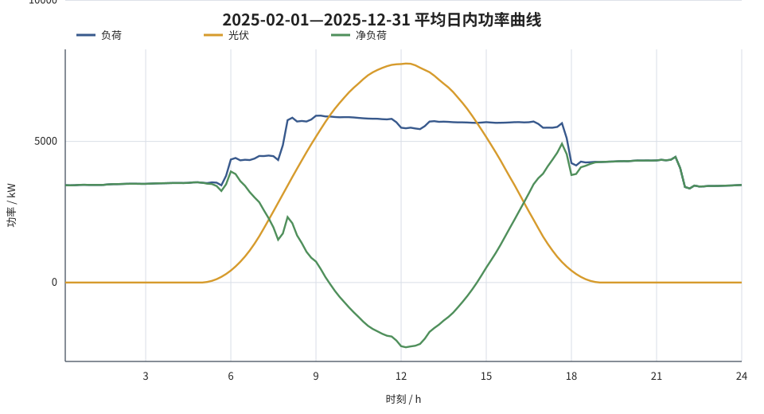
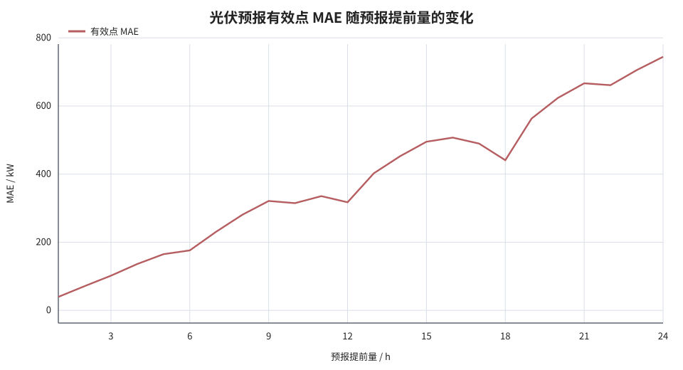
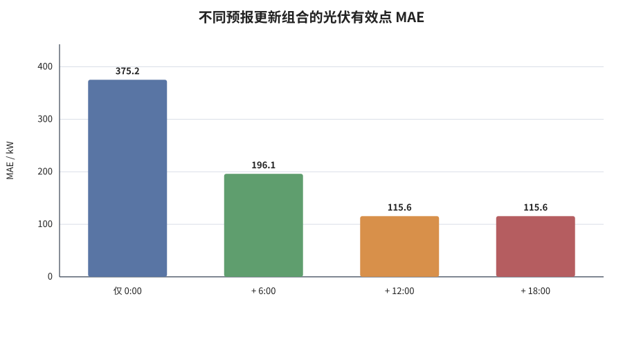

# C 题第三问：附件数据规律分析

## 1. 分析范围与口径

本文件仅分析附件 1—3 的数据结构与统计规律，不给出购电、储能、模型选择或预报使用方面的建议。

- 附件 1：单日 144 个 10 分钟时点的电价、小区负载和光伏预测功率。
- 附件 2：2025-01-01—2025-12-31 共 365 天的小区负载、光伏实际功率，每天 144 个 10 分钟时点。
- 附件 3：每天在 0:00、6:00、12:00、18:00 发布的未来 24 个整点光伏功率预报，共 $365\times4=1460$ 条预报记录。
- 与 `result3.xlsx` 的日期范围一致，汇总误差和主体统计使用 2025-02-01—2025-12-31，共 334 天；月度季节表额外保留 1 月以展示完整年度规律。

按 10 分钟离散步长将功率换算为电量：

$$
E_d=\frac{1}{6}\sum_{t=1}^{144}P_{d,t}.
$$

定义净负荷 $N_{d,t}=L_{d,t}-G_{d,t}$。$N>0$ 表示负荷大于光伏，$N<0$ 表示该时点存在光伏剩余。预报误差定义为

$$
e=\widehat G-G,
$$

因此偏差 Bias 为负表示光伏预报总体偏低。误差统计采用 MAE、RMSE、Bias 和

$$
\mathrm{WAPE}=\frac{\sum|\widehat G-G|}{\sum G}\times100\%.
$$

为避免大量夜间零值稀释误差，另定义“光伏有效点”为实际值或参与比较的任一预报值不低于 10 kW 的整点；涉及不同版本预报的比较均对齐到完全相同的目标时刻。

## 2. 数据结构与质量

| 数据 | 理论规模 | 实际规模 | 时间覆盖 | 缺失值 | 负值 |
|---|---:|---:|---|---:|---:|
| 附件 1 电价/负载/光伏 | 1 天 × 144 点 | 144 点 | 00:10—24:00 | 0 | 0 |
| 附件 2 负载 | 365 天 × 144 点 | 52,560 点 | 2025 全年 | 0 | 0 |
| 附件 2 光伏实际功率 | 365 天 × 144 点 | 52,560 点 | 2025 全年 | 0 | 0 |
| 附件 3 光伏预报 | 365 天 × 4 时刻 × 24 点 | 35,040 点 | 2025 全年 | 0 | 0 |

数据中的 10 分钟时间网格完整且等间隔。`0:00+1` 表示当天 24:00，即次日 0:00；在跨日对齐时只作为当天最后一个端点处理。附件 3 每个日期仅在 0:00 行填写日期，随后 6:00、12:00、18:00 三行的日期单元格为空，这是表格的分组写法，按前值填充后每天均恰有 4 条记录，并不存在缺报。

附件 3 的“预报 1 小时”表示发布时刻后第 1 个整点的功率点值，而不是随后 1 小时的平均功率。用 0:00 预报作检验，整点端点对齐和“前一小时平均功率”对齐的结果如下。

| 对齐方式 | 样本数 | MAE/kW | RMSE/kW | WAPE | 相关系数 |
|---|---:|---:|---:|---:|---:|
| 与附件 2 的对应整点功率对齐 | 8,016 | 186.735 | 378.684 | 7.853% | 0.9920 |
| 与整点前 1 小时平均功率对齐 | 8,016 | 349.847 | 575.068 | 14.707% | 0.9814 |

在相同的 4,278 个共同有效点上，两种对齐方式的 MAE 分别为 349.897 kW 和 655.434 kW，整点语义与数据本身一致。

## 3. 电价规律

附件 1 的电价在第三问中每日重复使用。144 个 10 分钟价格的统计结果为：

| 指标 | 数值 |
|---|---:|
| 均值 | 0.7662 元/kWh |
| 中位数 | 0.8074 元/kWh |
| 标准差 | 0.3133 元/kWh |
| 变异系数 | 40.89% |
| 最低值 | 0.3713 元/kWh（05:40 时点） |
| 最高值 | 1.3952 元/kWh（20:40 时点） |
| 最高/最低比 | 3.7576 |

按 6 小时分段，均价依次为：

| 时间段 | 均价/(元/kWh) |
|---|---:|
| 00:00—06:00 | 0.4489 |
| 06:00—12:00 | 0.8528 |
| 12:00—18:00 | 0.8368 |
| 18:00—24:00 | 0.9263 |

价格曲线具有早晚两个较高区段：8:00—9:00 的小时均价为 1.0815 元/kWh，18:00—21:00 的三个小时均价依次为 1.2737、1.3483 和 1.2652 元/kWh；11:00—12:00 又降至 0.4729 元/kWh。每日平均净负荷曲线与价格曲线的 Pearson 相关系数仅为 0.0872，二者在线性意义上的同步性很弱。

## 4. 负荷、光伏与净负荷规律

### 4.1 总量与日分布

2025-02-01—2025-12-31 的负荷总电量为 37.0081 GWh，光伏总发电量为 19.0689 GWh，后者相当于前者的 51.53%。逐时直接取 \(\min(L,G)\) 得到的光伏—负荷同期重合电量为 16.0107 GWh，占光伏发电量的 83.96%；逐时光伏剩余总量为 3.0582 GWh，占光伏发电量的 16.04%。334 天中有 317 天至少出现一次光伏剩余。

主要日尺度指标如下，单位均为 MWh/日。

| 指标 | 均值 | P10 | 中位数 | P90 | 最小值 | 最大值 |
|---|---:|---:|---:|---:|---:|---:|
| 负荷电量 | 110.803 | 72.639 | 117.985 | 135.608 | 71.490 | 141.566 |
| 光伏电量 | 57.092 | 40.547 | 59.364 | 69.217 | 34.836 | 75.223 |
| 净电量（负荷−光伏） | 53.710 | 16.044 | 60.154 | 77.596 | 0.070 | 89.470 |
| 正净负荷累计量 | 62.866 | 38.932 | 66.289 | 79.035 | 32.990 | 89.470 |
| 光伏剩余量 | 9.156 | 0.413 | 6.581 | 24.789 | 0 | 33.416 |

日极值对应日期为：

| 指标 | 最小值及日期 | 最大值及日期 |
|---|---|---|
| 日负荷电量 | 71.490 MWh，2025-04-18 | 141.566 MWh，2025-07-03 |
| 日光伏电量 | 34.836 MWh，2025-12-15 | 75.223 MWh，2025-08-03 |
| 日净电量 | 0.070 MWh，2025-04-26 | 89.470 MWh，2025-12-15 |
| 正净负荷累计量 | 32.990 MWh，2025-04-25 | 89.470 MWh，2025-12-15 |
| 光伏剩余量 | 0 MWh，多日 | 33.416 MWh，2025-04-26 |

2025-04-26 的全天负荷和光伏分别为 72.101 MWh 和 72.031 MWh，二者日总量只差 0.070 MWh；但分时统计中仍同时存在 33.486 MWh 的正净负荷和 33.416 MWh 的光伏剩余，显示日总量接近并不等于各时点功率平衡。

附录给出的可用储电区间为 $10800-1200=9600$ kWh。单日光伏剩余量超过 9.6 MWh 的日期有 108 天，占 334 天的 32.34%；这一统计只比较日累计量，不包含日内 SOC 过程。

### 4.2 季节规律

| 月份 | 日均负荷/MWh | 日均光伏/MWh | 光伏/负荷 | 日均光伏剩余/MWh |
|---:|---:|---:|---:|---:|
| 1 | 113.419 | 38.140 | 33.63% | 2.002 |
| 2 | 108.406 | 47.196 | 43.54% | 4.959 |
| 3 | 104.537 | 55.301 | 52.90% | 9.151 |
| 4 | 105.431 | 64.840 | 61.50% | 13.154 |
| 5 | 105.640 | 67.356 | 63.76% | 14.003 |
| 6 | 115.209 | 56.876 | 49.37% | 5.591 |
| 7 | 128.094 | 65.358 | 51.02% | 7.767 |
| 8 | 121.084 | 69.984 | 57.80% | 14.136 |
| 9 | 108.862 | 62.582 | 57.49% | 12.951 |
| 10 | 104.328 | 56.744 | 54.39% | 11.707 |
| 11 | 104.104 | 44.505 | 42.75% | 5.462 |
| 12 | 112.591 | 36.332 | 32.27% | 1.449 |

负荷的月度高点在 7 月，日均 128.094 MWh；光伏月度高点在 8 月，日均 69.984 MWh。光伏/负荷比在 5 月最高，为 63.76%，12 月最低，为 32.27%。光伏剩余主要集中在 4—5 月和 8—10 月，冬季明显较少。

### 4.3 周期性

按公历星期汇总 334 天的数据：

| 星期 | 天数 | 日均负荷/MWh | 日均光伏/MWh | 日均净电量/MWh |
|---|---:|---:|---:|---:|
| 周一 | 48 | 123.684 | 56.959 | 66.725 |
| 周二 | 48 | 123.942 | 56.680 | 67.262 |
| 周三 | 48 | 123.856 | 56.581 | 67.275 |
| 周四 | 47 | 123.740 | 57.669 | 66.071 |
| 周五 | 47 | 78.057 | 57.701 | 20.356 |
| 周六 | 48 | 78.163 | 56.938 | 21.225 |
| 周日 | 48 | 123.763 | 57.143 | 66.620 |

负荷数据存在非常稳定的 7 天周期：周五、周六的平均日负荷为 78.110 MWh，其余五天为 123.797 MWh，前者低 36.90%；日负荷的 7 日滞后相关系数为 0.9873，而 1 日滞后相关系数为 0.3778。低负荷日落在周五和周六，而不是通常的周六和周日组合。光伏在各星期组之间较稳定，日均值范围仅为 56.581—57.701 MWh；光伏日发电量的 1 日和 7 日滞后相关系数分别为 0.9564 和 0.9130，主要呈连续的季节变化。

### 4.4 日内形态与波动

| 时间段 | 平均负荷/kW | 平均光伏/kW | 平均净负荷/kW |
|---|---:|---:|---:|
| 00:00—06:00 | 3,529.51 | 31.36 | 3,498.15 |
| 06:00—12:00 | 5,388.21 | 4,834.82 | 553.39 |
| 12:00—18:00 | 5,572.83 | 4,629.77 | 943.07 |
| 18:00—24:00 | 3,976.55 | 19.46 | 3,957.09 |

- 平均负荷在 09:10 达到 5,914.68 kW 的日内峰值。
- 平均光伏在 12:10 达到 7,759.62 kW 的日内峰值；按表中时点计，平均光伏不低于 10 kW 的连续范围为 05:10—18:50。
- 平均净负荷在 12:10 降至 −2,293.83 kW，在 17:40 升至 4,918.77 kW；按表中时点计，平均净负荷为负的连续范围为 09:30—14:40。
- 全部 48,096 个 10 分钟时点中，净负荷为负的时点有 9,830 个，占 20.44%。

逐点极值为：

| 指标 | 极值 | 时刻 |
|---|---:|---|
| 负荷最大功率 | 7,978.88 kW | 2025-07-16 17:40 |
| 光伏最大功率 | 10,216.20 kW | 2025-04-26 11:30 |
| 净负荷最大值 | 6,687.75 kW | 2025-09-28 17:40 |
| 反向净负荷最大值 | 6,601.99 kW | 2025-09-13 11:50 |

与附录中的 5,000 kW 最大充放电功率作数值对照，净负荷超过 5,000 kW 的时点有 3,013 个，占 6.26%；反向净负荷超过 5,000 kW 的时点有 241 个，占 0.50%。负荷与光伏逐点相关系数为 0.5751，反映二者在白天存在中等强度的同期变化。

相邻 10 分钟绝对变化量的统计为：负荷均值 142.80 kW、P95 为 418.52 kW、最大值 1,706.02 kW；光伏均值 122.04 kW、P95 为 389.68 kW、最大值 970.24 kW。

## 5. 光伏预报误差规律

### 5.1 误差随预报提前量变化

下表汇总附件 3 的全部发布时刻，并按预报提前量分为四组。只统计光伏有效点。

| 提前量 | 有效点数 | MAE/kW | RMSE/kW | Bias/kW | WAPE |
|---|---:|---:|---:|---:|---:|
| 1—6 h | 3,989 | 115.562 | 187.583 | −1.315 | 2.418% |
| 7—12 h | 3,990 | 300.365 | 433.932 | −33.741 | 6.288% |
| 13—18 h | 3,983 | 464.714 | 659.605 | −83.762 | 9.723% |
| 19—24 h | 3,980 | 661.692 | 977.477 | −141.706 | 13.847% |

四个 6 小时组的 MAE、RMSE 和 WAPE 均随提前量增加而递增；有效点 MAE 从 1—6 h 的 115.562 kW 增至 19—24 h 的 661.692 kW，约为前者的 5.73 倍。Bias 由接近 0 逐步变为 −141.706 kW，长提前量预报呈更明显的低估倾向。逐小时结果并非每一个相邻小时都严格递增，但总体和分组趋势一致。

### 5.2 同一目标时刻的滚动预报变化

为隔离不同发布时间的影响，对同一目标整点进行配对比较：6:00 预报与 0:00 预报比较当天 7:00—24:00；12:00 预报与 6:00 预报比较 13:00—24:00；18:00 预报与 12:00 预报比较 19:00—24:00。

| 新发布时间 | 上一版本 | 当天目标整点 | 有效点数 | 上一版 MAE/kW | 新版 MAE/kW | MAE 变化 | 新版误差更小的有效点 | 新版日均 MAE 更低的天数 |
|---:|---:|---|---:|---:|---:|---:|---:|---:|
| 06:00 | 00:00 | 7:00—24:00 | 3,807 | 391.586 | 203.857 | −47.94% | 71.24% | 285/334（85.33%） |
| 12:00 | 06:00 | 13:00—24:00 | 1,827 | 253.012 | 77.214 | −69.48% | 78.22% | 307/334（91.92%） |
| 18:00 | 12:00 | 19:00—24:00 | 0 | — | — | — | — | — |

6:00 更新对应有效点的 RMSE 从 549.404 kW 降至 302.757 kW，WAPE 从 7.880% 变为 4.102%；配对绝对误差平均减少 187.730 kW，其正态近似 95% 置信区间为 [175.442, 200.017] kW。12:00 更新对应有效点的 RMSE 从 354.215 kW 降至 105.285 kW，WAPE 从 5.613% 变为 1.713%；配对绝对误差平均减少 175.798 kW，95% 置信区间为 [164.367, 187.228] kW。

18:00 后属于当天的 2,004 个目标整点中，实际光伏非零者仅 20 个，实际最大值仅 8.7375 kW，因此没有一个时点达到 10 kW 的有效点阈值。在全部点上，12:00 版与 18:00 版的 MAE 分别为 0.002358 kW 和 0.000358 kW；18 天的日均 MAE 下降，315 天完全相同，1 天上升。这里的相对降幅虽为 84.80%，但对应的绝对量级低于 0.003 kW。

### 5.3 将日内各时段替换为最新预报后的整体误差

以下“预报信息组合”只用于统计：目标 1:00—6:00 使用 0:00 版，目标 7:00—12:00 可换为 6:00 版，目标 13:00—18:00 可再换为 12:00 版，目标 19:00—24:00 可再换为 18:00 版。表中仍只统计相同的 3,989 个有效点。

| 预报信息组合 | MAE/kW | RMSE/kW | Bias/kW | WAPE | P90绝对误差/kW | 相关系数 | 相对仅0:00日均MAE更低的天数 |
|---|---:|---:|---:|---:|---:|---:|---:|
| 仅 0:00 | 375.244 | 536.814 | −57.667 | 7.853% | 901.906 | 0.9785 | — |
| 0:00 + 6:00 | 196.079 | 295.933 | −13.452 | 4.103% | 510.218 | 0.9934 | 285/334（85.33%） |
| 0:00 + 6:00 + 12:00 | 115.562 | 187.583 | −1.315 | 2.418% | 291.720 | 0.9973 | 328/334（98.20%） |
| 0:00 + 6:00 + 12:00 + 18:00 | 115.562 | 187.583 | −1.315 | 2.418% | 291.720 | 0.9973 | 328/334（98.20%） |

在全部 8,016 个整点上，最后两种组合的 MAE 分别为 57.508260 kW 和 57.507760 kW，加入 18:00 版后只变化 0.000500 kW。相对于仅使用 0:00 版，加入 6:00 版后有效点 MAE 降低 47.75%，再计入 12:00 版后累计降低 69.20%。完整滚动组合有 6 天的日均 MAE 高于仅 0:00 版，日期为 03-14、05-04、07-22、11-07、11-14 和 12-12。

### 5.4 月度预报误差

| 月份 | 仅0:00有效点MAE/kW | 完整滚动有效点MAE/kW | MAE降幅 |
|---:|---:|---:|---:|
| 2 | 350.622 | 108.259 | 69.12% |
| 3 | 408.823 | 115.971 | 71.63% |
| 4 | 369.968 | 111.465 | 69.87% |
| 5 | 340.664 | 120.897 | 64.51% |
| 6 | 353.198 | 108.882 | 69.17% |
| 7 | 379.898 | 116.083 | 69.44% |
| 8 | 430.291 | 114.625 | 73.36% |
| 9 | 399.825 | 130.519 | 67.36% |
| 10 | 485.209 | 135.463 | 72.08% |
| 11 | 293.216 | 106.740 | 63.60% |
| 12 | 295.402 | 98.329 | 66.71% |

仅 0:00 预报的月度有效点 MAE 在 10 月最高，为 485.209 kW，在 11 月最低，为 293.216 kW；完整滚动组合的月度 MAE 范围为 98.329—135.463 kW。各月的 MAE 变化幅度均为下降 63.60%—73.36%，但绝对误差仍具有明显月际差异。

### 5.5 题目指定日期

| 日期 | 负荷/MWh | 光伏/MWh | 光伏剩余/MWh | 有效整点数 | 仅0:00 MAE/kW | 完整滚动 MAE/kW | MAE变化 |
|---|---:|---:|---:|---:|---:|---:|---:|
| 2025-03-20 | 117.648 | 55.439 | 3.911 | 11 | 623.782 | 211.591 | −66.08% |
| 2025-06-21 | 81.408 | 62.073 | 20.959 | 13 | 191.854 | 155.852 | −18.77% |
| 2025-09-23 | 121.182 | 59.066 | 6.478 | 11 | 221.413 | 60.781 | −72.55% |
| 2025-12-21 | 124.376 | 35.339 | 0 | 9 | 172.463 | 154.561 | −10.38% |

四个指定日期覆盖了不同的负荷—光伏关系：6 月 21 日的日负荷最低而光伏剩余最高，12 月 21 日没有光伏剩余；滚动预报的有效点 MAE 变化幅度从 10.38% 到 72.55% 不等，说明单日误差改善程度具有较强异质性。

## 6. 规律汇总

1. 三个附件的时间网格、日期和数值均完整，无缺失、负值或重复日期—发布时间组合；附件 3 的对齐对象为未来整点功率。
2. 负荷同时具有显著日内周期、季节变化和几乎固定的 7 天周期，其中周五、周六形成低负荷组；光伏的主要变化来自日内太阳辐照形态和季节变化。
3. 平均净负荷呈“夜间高、午间低、傍晚再升高”的形态，09:30—14:40 的平均净负荷为负；20.44% 的实际 10 分钟时点存在光伏剩余。
4. 光伏预报误差随提前量总体上升，且长提前量预报逐渐呈负偏差；1—6 h 与 19—24 h 有效点 MAE 分别为 115.562 kW 和 661.692 kW。
5. 在相同目标整点上，6:00 版相对 0:00 版、12:00 版相对 6:00 版的有效点 MAE 分别变化 −47.94% 和 −69.48%；18:00 后当天剩余整点的光伏功率基本为零，所有版本之间只存在瓦级到亚瓦级的平均误差差异。
6. 预报误差改善并非逐日一致：完整滚动组合在 328 天低于仅 0:00 版，在 6 天高于仅 0:00 版；四个指定日期的 MAE 变化幅度也有明显差别。

## 7. 可复核中间结果

全部中间文件位于 `result/3/tmp`：

- [分析脚本](tmp/analyze_question3_data.py)
- [完整统计结果（JSON）](tmp/analysis_results.json)
- [逐月能源统计](tmp/monthly_energy_summary.csv)
- [10 分钟平均曲线](tmp/mean_10min_profile.csv)
- [预报提前量误差](tmp/forecast_horizon_metrics.csv)
- [滚动预报配对比较](tmp/forecast_update_metrics.csv)
- [预报信息组合误差](tmp/forecast_policy_metrics.csv)
- [指定日期统计](tmp/selected_date_summary.csv)
