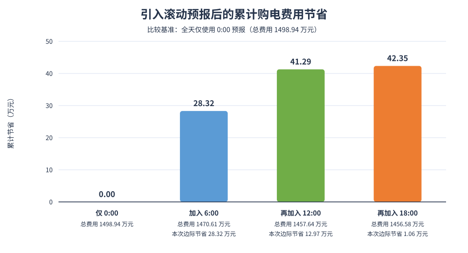
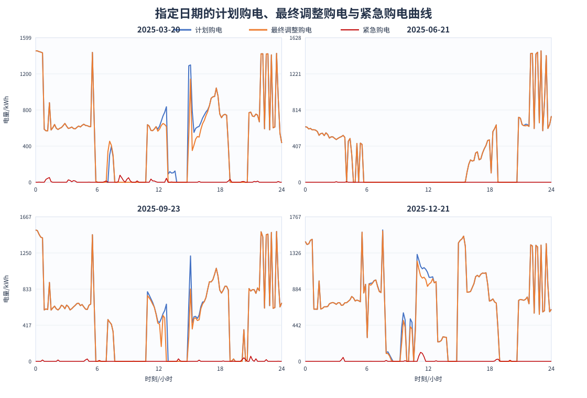

# C 题第三问：滚动随机优化模型与购电策略

## 1. 结论

结合[第三问附件数据规律分析](data_analysis_3.md)，建立以 10 分钟为步长的四阶段滚动随机线性规划模型：每天 0:00 形成计划购电曲线，在 6:00、12:00、18:00 只重算尚未执行的区间，并将光伏和负荷预测误差作为紧急购电情景纳入目标函数。

对 2025-02-01—2025-12-31 共 334 天求解后，采用全部四个发布时刻的策略得到：

- 计划购电量为 22,587.907 MWh，最终调整购电量为 22,127.296 MWh，紧急购电量为 206.776 MWh；
- 计划购电费为 1,379.804 万元，上调费用为 22.485 万元，下调返还为 21.477 万元，紧急购电费为 75.772 万元；
- 总购电费为 **1,456.584 万元**；相对全天仅使用 0:00 预报的策略节省 **42.352 万元，降幅 2.825%**；
- 6:00、12:00、18:00 三次更新的边际节省依次为 28.324 万元、12.970 万元和 1.059 万元。

完整策略已写入 [result3.xlsx](result3.xlsx)。

## 2. 建模口径与假设

1. 将一天划分为 144 个 10 分钟区间，$Delta t=1/6$ h；功率乘以 $Delta t$ 后转为区间电量。
2. 题目只要求微网供电不低于负荷，因此光伏富余且储能无法继续充电时允许弃光，不计售电收入。
3. 0:00、6:00、12:00、18:00 发布时刻之前的实际负荷、光伏功率和 SOC 已知；尚未发生的负荷由历史同星期曲线预测。
4. 调整量始终相对 0:00 的原计划结算；已经执行的区间保持不变，只对当前时刻之后的区间重新优化。
5. 为消除有限时域末端将储能放空所造成的虚假收益，每个滚动日的首末 SOC 均取 6000 kWh。该约束同时使相邻滚动日的储能状态连续。
6. 上调、下调与紧急购电均按对应交易区间的原电价结算；下调部分的 50% 违约价等价于退回该部分原购电费用的 50%。

附件及结果模板采用从 `0:10-0:20` 到 `0:00-0:10+1` 的 144 列顺序。计算与写表严格按该顺序一一对应；储能表中的公历 0:00—24:00 数据由相邻两行边界重构。

## 3. 预测与不确定性描述

### 3.1 光伏预测的 10 分钟化

附件 3 给出未来 24 个整点功率。对发布时间 $r$ 和相邻两个整点 $h,h+1$，采用线性插值：

$$
\widehat G_{d,t}^{(r)}=(1-\lambda)\widehat G_{d,h}^{(r)}
+\lambda\widehat G_{d,h+1}^{(r)},\qquad 0\leq\lambda\leq1.
$$

发布时间处以当时已经观测到的实际光伏功率作为插值锚点，并将数值截断为非负值。

### 3.2 负荷预测

附件 2 显示日负荷具有很强的 7 日周期，7 日滞后相关系数为 0.9873。因此以同星期前一周的曲线作为基准。在日内更新时，用当前日已观测负荷与前一周同期负荷的累计比值作比例修正：

$$
\alpha_{d,r}=\operatorname{clip}\left(
\frac{\sum_{t<r}L_{d,t}}{\sum_{t<r}L_{d-7,t}},0.90,1.10
\right),
\qquad
\widehat L_{d,t}^{(r)}=\alpha_{d,r}L_{d-7,t}.
$$

0:00 尚无当日观测值，取 $\alpha_{d,0}=1$。

### 3.3 净负荷残差情景

定义发布时刻 $r$ 下的区间净负荷残差为

$$
\varepsilon_{d,t}^{(r)}=
\left(L_{d,t}-G_{d,t}\right)\Delta t-
\left(\widehat L_{d,t}^{(r)}-\widehat G_{d,t}^{(r)}\right)\Delta t.
$$

对每个待决区间，取当前日期之前最多 28 天残差的 5%、20%、35%、50%、65%、80%、95% 分位数，形成 7 条等概率情景 $\xi_{t,omega}^{(r)}$。这样既利用了最新预测，也保留了历史预测误差可能造成的紧急购电风险。

## 4. 四阶段滚动随机线性规划模型

### 4.1 符号

| 符号 | 含义 | 单位 |
|---|---|---|
| $p_t$ | 第 $t$ 个区间的交易电价 | 元/kWh |
| $q_t^0$ | 0:00 制定的计划购电量 | kWh |
| $q_t^r$ | 发布时刻 $r\in\{6,12,18\}$ 后的调整购电量 | kWh |
| $a_{t}^{r,+},a_{t}^{r,-}$ | 相对原计划的上调量、下调量 | kWh |
| $c_t^r,d_t^r$ | 储能充电量、向微网放电量 | kWh |
| $S_t^r$ | 区间末储电量 | kWh |
| $u_{t,omega}^r$ | 情景 $\omega$ 下的紧急购电量 | kWh |
| $\widehat N_{t}^{r}$ | 预测净负荷 $(\widehat L-\widehat G)\Delta t$ | kWh |

### 4.2 储能约束

充电量按进入储能前的母线侧电量计，放电量按供给微网的母线侧电量计。充放电效率均为 0.9，因此

$$
S_t^r=S_{t-1}^r+0.9c_t^r-\frac{d_t^r}{0.9}.
$$

最大充放电功率为 5000 kW，故每个 10 分钟区间最多充电或放电 $5000/6=833.333$ kWh：

$$
0\leq c_t^r,d_t^r\leq833.333,
\qquad 1200\leq S_t^r\leq10800.
$$

日首末状态约束为

$$
S_{mathrm{end}}^r=S_{mathrm{start}}^r=6000.
$$

在目标函数中加入极小的循环损耗项 $\epsilon(c_t^r+d_t^r)$，其中 $\epsilon=10^{-5}$ 元/kWh，用于在费用相同的多个解中排除无意义的同时充放电，不影响正常电价决策。

### 4.3 供需平衡

在每个预测误差情景下均要求

$$
q_t^r+d_t^r-c_t^r+u_{t,omega}^r
\geq \widehat N_t^r+\xi_{t,omega}^r,
\qquad u_{t,omega}^r\geq0.
$$

若右端为负，差额即为允许弃掉的光伏电量。

### 4.4 计划阶段目标

0:00 阶段同时权衡计划购电费和未来紧急购电的期望费用：

$$
\min C^0=
\sum_t p_tq_t^0+
\frac{1}{7}\sum_{\omega=1}^{7}\sum_t5p_tu_{t,\omega}^0
+\epsilon\sum_t(c_t^0+d_t^0).
$$

### 4.5 调整阶段目标

用非负变量线性化相对原计划的变化：

$$
q_t^r=q_t^0+a_t^{r,+}-a_t^{r,-},qquad
0\leq a_t^{r,-}\leq q_t^0.
$$

由于原计划费用在调整时已是常数，发布时刻 $r$ 的待优化部分目标为

$$
\min C^r=
\sum_{t\geq r}p_t\left(1.5a_t^{r,+}-0.5a_t^{r,-}\right)
+\frac{1}{7}\sum_{\omega=1}^{7}\sum_{t\geq r}5p_tu_{t,omega}^r
+\epsilon\sum_{t\geq r}(c_t^r+d_t^r).
$$

若 $q_t^r<q_t^0$，总费用中的该区间项为 $p_tq_t^0-0.5p_t(q_t^0-q_t^r)$，等价于实际调整量按原价支付、取消量按 50% 原价承担违约成本；若 $q_t^r>q_t^0$，超出部分按 1.5 倍电价支付。

### 4.6 实际紧急购电与总费用

最终执行曲线按最新可用方案拼接：

$$
q_t=\begin{cases}
q_t^0,&0{:}00\leq t<6{:}00,\\
q_t^6,&6{:}00\leq t<12{:}00,\\
q_t^{12},&12{:}00\leq t<18{:}00,\\
q_t^{18},&18{:}00\leq t<24{:}00.
\end{cases}
$$

在实际负荷和实际光伏实现后，区间紧急购电量为

$$
e_t=\max\left\{0,
(L_t-G_t)\Delta t+c_t-d_t-q_t
\right\}.
$$

最终实际总购电费为

$$
C=\sum_t\left[
p_tq_t^0
+1.5p_t(q_t-q_t^0)^+
-0.5p_t(q_t^0-q_t)^+
+5p_te_t
\right].
$$

## 5. 求解流程与购电策略

每天的执行顺序如下：

1. 0:00：读取 0:00 光伏预报，以前一周同星期负荷和过去最多 28 天残差建立 7 个净负荷情景，求得 144 个区间的计划购电、充电和放电量。
2. 6:00：冻结已执行区间，读取 6:00 新预报和当前 SOC，更新负荷比例及残差情景，重算后 18 小时。
3. 12:00：以同样方式重算后 12 小时；18:00 再重算后 6 小时。
4. 实际净负荷超出“最终调整购电量＋放电量−充电量”的部分自动计入 5 倍价格的紧急购电；连续正值区间在结果表中合并。

所得策略的日内结构与附件规律一致：低价夜间以及午间光伏富余区间主要用于充电，早间和 18:00—21:00 的高价、正净负荷区间主要用于放电；预报更新后主要对尚未执行的购电量作下调。全年累计上调 202.400 MWh、下调 663.011 MWh，最终调整购电量比原计划低 460.611 MWh。

## 6. 全年结果与预报发布时间的作用

| 预报信息组合 | 最终调整购电量/MWh | 紧急购电量/MWh | 总购电费/万元 | 相对仅 0:00 节省/万元 | 本次更新边际节省/万元 |
|---|---:|---:|---:|---:|---:|
| 仅 0:00 | 22,587.907 | 319.977 | 1,498.936 | 0 | 0 |
| 0:00＋6:00 | 22,325.058 | 213.106 | 1,470.612 | 28.324 | 28.324 |
| 0:00＋6:00＋12:00 | 22,130.012 | 208.362 | 1,457.643 | 41.293 | 12.970 |
| 0:00＋6:00＋12:00＋18:00 | 22,127.296 | 206.776 | **1,456.584** | **42.352** | 1.059 |

完整四阶段策略的费用构成为：

| 费用项 | 金额/万元 | 计入总费用的符号 |
|---|---:|---:|
| 0:00 计划购电费 | 1,379.804 | $+$ |
| 上调购电费用 | 22.485 | $+$ |
| 下调购电返还 | 21.477 | $-$ |
| 紧急购电费用 | 75.772 | $+$ |
| 总购电费 | **1,456.584** | — |

最终实际外购电量为 22,334.072 MWh，其中紧急购电占 0.926%。紧急购电是模型中以 5 倍电价显式计价的实际补缺量，并非供需约束失效。

对“是否需要引入其他时刻预报”的判定如下：

- 6:00 更新使有效光伏点 MAE 相对 0:00 版本下降 47.94%，并降低费用 28.324 万元；12:00 更新使对应 MAE 再下降 69.48%，并额外降低费用 12.970 万元。因此这两个时刻具有明确的信息价值。
- 6:00 与 12:00 已贡献完整滚动策略总节省额的 97.50%。18:00 后当日光伏实际最大值仅 8.7375 kW，18:00 新版预报使全部整点 MAE 只变化 0.000500 kW；其滚动重算的边际费用变化仅为 1.059 万元，占基准费用 0.071%。因此从光伏预报本身看，18:00 版本的信息增量可以忽略；该时刻剩余的小幅费用变化主要来自已观测负荷和 SOC 更新后的再优化。
- 提交的 `result3.xlsx` 仍采用全部四阶段策略，因为题设未设置一次调整的固定管理成本，且 18:00 重算在当前目标函数下仍产生非负经济价值。

## 7. 指定日期结果

下列电量均为 kWh，费用均为元。更完整的 144 区间结果见 `result3.xlsx`。

### 7.1 计划购电量

| 日期 | 10:00—10:10 | 12:00—12:10 | 14:00—14:10 | 16:00—16:10 | 18:00—18:10 | 20:00—20:10 | 全天购电量 | 计划购电费 |
|---|---:|---:|---:|---:|---:|---:|---:|---:|
| 2025-03-20 | 0 | 587.011 | 0 | 617.822 | 755.707 | 0 | 73,215.377 | 44,841.61 |
| 2025-06-21 | 0 | 0 | 0 | 202.998 | 476.466 | 0 | 40,038.921 | 23,454.81 |
| 2025-09-23 | 0 | 459.970 | 0 | 533.408 | 821.914 | 0 | 74,812.319 | 46,615.27 |
| 2025-12-21 | 0 | 1,089.330 | 0 | 847.458 | 736.818 | 0 | 101,492.742 | 65,344.35 |

### 7.2 最终调整购电量

| 日期 | 10:00—10:10 | 12:00—12:10 | 14:00—14:10 | 16:00—16:10 | 18:00—18:10 | 20:00—20:10 | 全天调整购电量 | 当天总购电费 |
|---|---:|---:|---:|---:|---:|---:|---:|---:|
| 2025-03-20 | 0 | 565.014 | 0 | 499.430 | 755.707 | 0 | 70,558.440 | 47,202.73 |
| 2025-06-21 | 0 | 0 | 0 | 202.998 | 476.466 | 0 | 40,011.496 | 23,469.76 |
| 2025-09-23 | 0 | 440.055 | 0 | 479.055 | 821.914 | 0 | 72,572.111 | 47,526.20 |
| 2025-12-21 | 0 | 916.998 | 0 | 847.458 | 736.818 | 0 | 99,731.218 | 66,274.21 |

“当天总购电费”包括计划费用、上调费用、下调返还和紧急购电费用，并非仅对调整后电量按原价相乘。

### 7.3 储能充放电结果

| 日期 | 时间段 | 充电量 | 放电量 | 0:00 储电量 | 24:00 储电量 |
|---|---|---:|---:|---:|---:|
| 2025-03-20 | 0:00—4:00 | 4,500.000 | 0 | 6,000.000 | 6,000.000 |
|  | 4:00—8:00 | 833.333 | 5,476.987 |  |  |
|  | 8:00—12:00 | 4,688.163 | 3,163.013 |  |  |
|  | 12:00—16:00 | 6,668.947 | 559.260 |  |  |
|  | 16:00—20:00 | 2.836 | 4,930.341 |  |  |
|  | 20:00—24:00 | 5,333.333 | 3,711.956 |  |  |
| 2025-06-21 | 0:00—4:00 | 0 | 0 | 6,000.000 | 6,000.000 |
|  | 4:00—8:00 | 0 | 4,060.901 |  |  |
|  | 8:00—12:00 | 3,077.374 | 0 |  |  |
|  | 12:00—16:00 | 7,269.417 | 52.807 |  |  |
|  | 16:00—20:00 | 67.032 | 5,116.870 |  |  |
|  | 20:00—24:00 | 5,333.333 | 3,524.619 |  |  |
| 2025-09-23 | 0:00—4:00 | 4,500.000 | 0 | 6,000.000 | 5,998.307 |
|  | 4:00—8:00 | 844.689 | 5,251.913 |  |  |
|  | 8:00—12:00 | 5,072.151 | 3,397.285 |  |  |
|  | 12:00—16:00 | 6,127.738 | 431.910 |  |  |
|  | 16:00—20:00 | 14.456 | 4,927.820 |  |  |
|  | 20:00—24:00 | 5,331.960 | 3,724.302 |  |  |
| 2025-12-21 | 0:00—4:00 | 4,500.000 | 0 | 6,000.000 | 6,000.000 |
|  | 4:00—8:00 | 1,678.830 | 690.845 |  |  |
|  | 8:00—12:00 | 5,000.000 | 8,293.669 |  |  |
|  | 12:00—16:00 | 8,774.300 | 2,858.086 |  |  |
|  | 16:00—20:00 | 12.292 | 4,820.425 |  |  |
|  | 20:00—24:00 | 5,333.333 | 3,828.967 |  |  |

2025-09-23 的 24:00 储电量与 6000 kWh 相差 1.693 kWh，是附件结果模板跨日列顺序下的日历时刻值；下一列 `0:00-0:10+1` 执行后回到滚动周期终端 6000 kWh，并与下一日状态连续。

### 7.4 紧急购电结果

| 2025-03-20 时间段 | 购电量 | 2025-06-21 时间段 | 购电量 | 2025-09-23 时间段 | 购电量 | 2025-12-21 时间段 | 购电量 |
|---|---:|---|---:|---|---:|---|---:|
| 0:30—0:40 | 1.700 | 3:10—3:20 | 6.107 | 0:50—1:00 | 15.990 | 3:10—3:20 | 0.100 |
| 1:10—1:50 | 132.897 | 4:10—4:20 | 6.671 | 2:20—2:30 | 15.481 | 3:40—4:00 | 66.955 |
| 3:20—4:10 | 83.665 | — | — | 5:00—5:20 | 43.826 | 6:30—6:40 | 0.892 |
| 5:20—5:30 | 0.920 | — | — | 6:10—6:40 | 13.799 | 8:00—8:10 | 10.787 |
| 6:50—7:10 | 20.941 | — | — | 9:40—9:50 | 2.208 | 9:50—10:00 | 7.739 |
| 8:10—8:50 | 155.284 | — | — | 14:00—14:20 | 34.265 | 11:10—11:50 | 332.400 |
| 9:00—9:30 | 97.565 | — | — | 16:00—16:10 | 14.528 | 12:50—13:00 | 6.591 |
| 10:00—10:10 | 15.274 | — | — | 18:20—18:30 | 4.043 | 18:30—19:10 | 57.378 |
| 11:20—12:00 | 68.520 | — | — | 20:10—20:40 | 82.773 | 20:00—20:10 | 12.668 |
| 12:50—13:00 | 43.786 | — | — | 21:00—21:20 | 74.850 | — | — |
| 13:20—13:30 | 2.663 | — | — | 21:30—21:40 | 29.531 | — | — |
| 16:00—16:10 | 7.894 | — | — | 22:30—22:40 | 20.215 | — | — |
| 18:50—19:10 | 44.795 | — | — | 23:40—23:50 | 1.960 | — | — |
| 20:10—20:30 | 15.487 | — | — | — | — | — | — |
| 21:20—21:50 | 25.738 | — | — | — | — | — | — |
| 23:40—0:00+1 | 8.229 | — | — | — | — | — | — |
| **全天合计** | **725.357** | **全天合计** | **12.778** | **全天合计** | **353.469** | **全天合计** | **495.509** |

## 8. 可行性与结果校验

对输出结果进行了独立复算，结论为 `PASS`：

- 检查 334 天、48,096 个 10 分钟区间，实际供需平衡最小裕量为 $-2.27\times10^{-13}$ kWh，仅为浮点误差；
- SOC 实际范围为 1200.000—10800.000 kWh；单区间最大充、放电量均为 833.333 kWh；
- 同时充电和放电的区间数为 0；每天费用复算的最大差值为 0 元；
- 工作簿包含“计划购电量”“调整购电量”“充放电量”“紧急购电量”四张表，数据行数分别为 334、334、2004、3998，日期范围与模板一致。

相关可复核文件均位于 `result/3/tmp`：

- [求解程序](tmp/solve_question3.py)
- [独立校验程序](tmp/verify_question3.py)
- [校验结果](tmp/question3_verification.json)
- [全年费用比较](tmp/question3_policy_comparison.csv)
- [每日汇总结果](tmp/question3_daily_solution.csv)
- [指定日期区间结果](tmp/question3_selected_intervals.csv)
- [指定日期储能结果](tmp/question3_selected_storage.csv)
- [指定日期紧急购电结果](tmp/question3_selected_emergency.csv)

