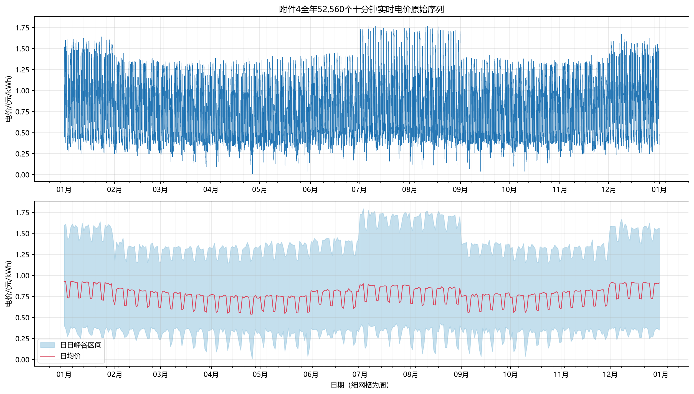

# C 题第四问：波动电价数据规律分析

## 1. 分析范围与口径

问题四在问题二、三的负荷、光伏和预报数据基础上，新增附件4的实时电价。附件4包含2025年365天、每天144个10分钟时段，共

$$
365\times144=52\,560
$$

个电价点。本文件仅陈述附件数据规律，不在此给出购电决策建议。

## 2. 数据质量与全量映射

| 检查项 | 结果 |
|---|---:|
| 日期范围 | 2025-01-01—12-31 |
| 原始观测数 | 52,560 |
| 每日观测数 | 144 |
| 日期缺口/重复 | 0/0 |
| 缺失或非有限值 | 0 |
| 非正电价 | 0 |
| 与附件2日期及10分钟网格 | 完全一致 |

下图上半部分直接绘制附件4全部52,560个原始点，没有抽样、聚合或截断；下半部分补充日均价和日内峰谷范围。横轴覆盖整年，细刻度为周。

## 3. 总体分布

| 指标 | 数值/(元/kWh) |
|---|---:|
| 全年均值 | 0.766198 |
| 中位数 | 0.738450 |
| 标准差 | 0.340670 |
| 5%分位数 | 0.338895 |
| 95%分位数 | 1.341900 |
| 最低值 | 0.0076（2025-04-26 12:00） |
| 最高值 | 1.7936（2025-07-03 20:40） |
| 日均价范围 | 0.537805—0.928992 |
| 平均日内峰谷差 | 1.107312 |

电价全年均值0.766198元/kWh与附件1固定日曲线的均值0.7662几乎一致，两者的平均偏差只有 $-3.82\times10^{-7}$ 元/kWh；但逐点MAE为0.099054元/kWh，表明“全年均值一致”不等于“某天某时刻价格相同”。

## 4. 月度变化

| 月份 | 均价 | 标准差 | 最低价 | 最高价 |
|---:|---:|---:|---:|---:|
| 1 | 0.8596 | 0.3745 | 0.2432 | 1.6401 |
| 2 | 0.7696 | 0.3200 | 0.2247 | 1.4470 |
| 3 | 0.7255 | 0.3146 | 0.0913 | 1.3583 |
| 4 | 0.6988 | 0.3065 | 0.0076 | 1.3932 |
| 5 | 0.6912 | 0.3078 | 0.0389 | 1.4134 |
| 6 | 0.7663 | 0.3156 | 0.1708 | 1.4509 |
| 7 | 0.8301 | 0.3665 | 0.1337 | 1.7936 |
| 8 | 0.7865 | 0.3691 | 0.0665 | 1.7686 |
| 9 | 0.7203 | 0.3210 | 0.0376 | 1.4221 |
| 10 | 0.7203 | 0.3177 | 0.0390 | 1.3793 |
| 11 | 0.7610 | 0.3245 | 0.2088 | 1.4244 |
| 12 | 0.8617 | 0.3760 | 0.2354 | 1.6698 |

月均价在5月最低，12月最高；7、8月和冬季的月内标准差较大。

## 5. 日周期和可预测性

将价格按整日曲线配对，得到：

| 关系 | 相关系数 |
|---|---:|
| 相邻日同时点 | 0.933539 |
| 相隔7日同时点 | 0.982037 |

7日滞后相关显著高于1日滞后，说明附件4除了日内峰谷外，还有很强的星期重复结构。

按真实时序进行2—12月滚动检验，下表的每个预报都只使用发布时刻以前的价格：

| 发布时刻 | 附件1固定曲线MAE | 前7日同刻MAE | 1月验证分时规则MAE |
|---|---:|---:|---:|
| 0:00 | 0.09632 | **0.04715** | **0.04715** |
| 6:00 | 0.11189 | 0.05048 | **0.04545** |
| 12:00 | 0.10641 | 0.04871 | **0.04143** |
| 18:00 | 0.08642 | 0.04317 | **0.03823** |

0:00时没有当日观测，分时规则等于前7日同刻。6:00后可以用已发生电价校正“前7日同刻与近7日均值”的混合曲线，所以误差随日内信息增加而降低。

## 6. 数据事实与决策信息的区分

附件4事后给出全年实际电价，但这并不意味着每天0:00时已经知道当天全部价格。进行因果评价时，未来价格是预报对象，附件4真实值只用于时段发生后结算和评分。完全预知当天价格只能构成非可实施的事后参考。

## 7. 可复核材料

- [价格全量折线图](tmp/attachment4_full_price_series.png)
- [总体统计](tmp/question4_data_metrics.json)
- [逐日统计](tmp/question4_daily_price_statistics.csv)
- [月度统计](tmp/question4_monthly_price_statistics.csv)
- [价格因果预报指标](tmp/price_forecast_metrics.csv)
- [分析程序](../../program/4/analyze_data_q4.py)
