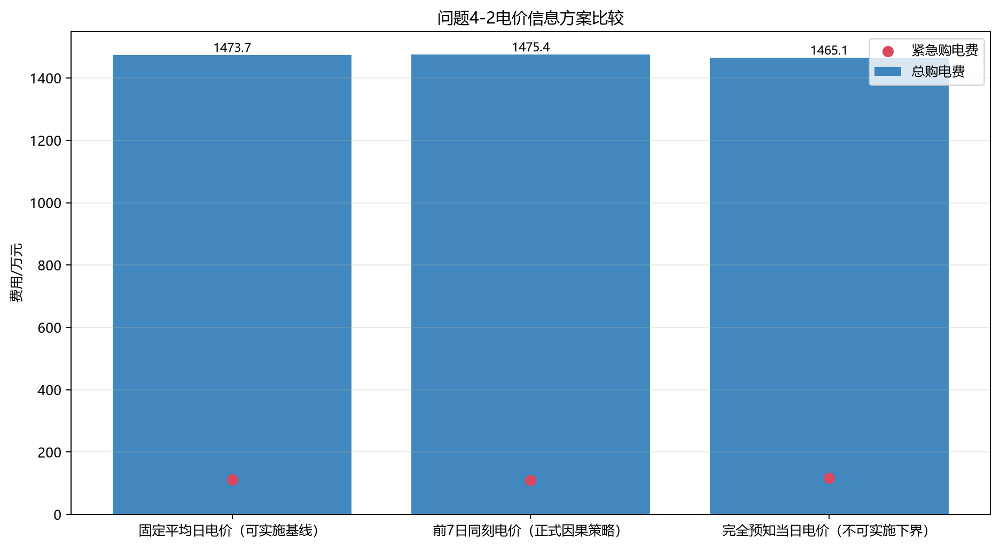
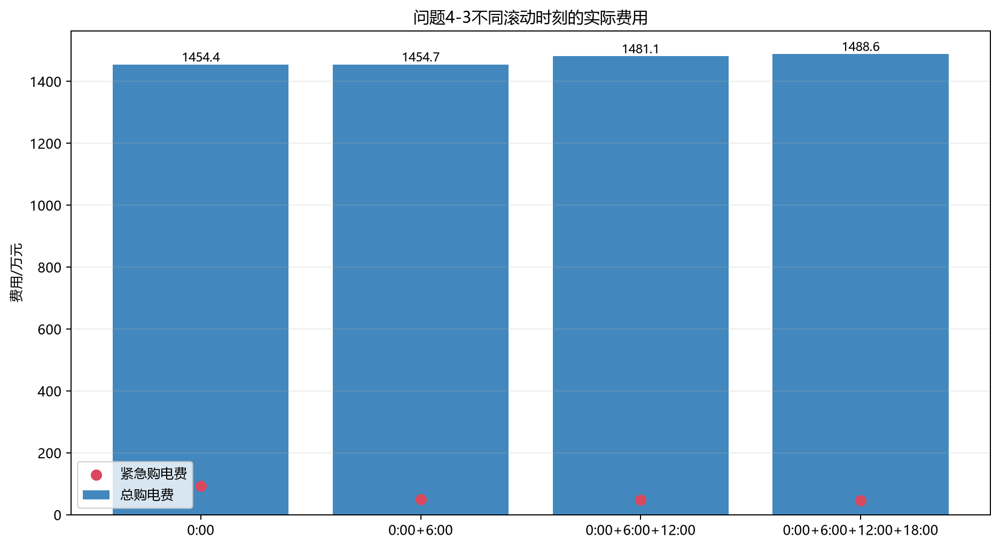

# C 题第四问解答2：波动电价下的因果调度

> 问题4-2的完整结果见 [result4-2.xlsx](result4-2.xlsx)，问题4-3的完整结果见 [result4-3.xlsx](result4-3.xlsx)，附件4数据规律见 [data_analysis_4.md](data_analysis_4.md)。

## 1. 我的解题思路

第四问不是简单地把问题二、三目标函数中的固定电价换成附件4当天真值。若这样做，等价于每天0:00已知未来全部实时电价，会产生前视偏差。

因此把“决策电价”和“结算电价”分开：

- 做计划时，目标函数只使用当时能得到的因果电价预报 $\widehat p_{d,t}^{(r)}$；
- 时段真实发生后，才用附件4的实际电价 $p_{d,t}$ 计算计划费、调整费和紧急费；
- 完全预知当日实际价格只作为事后下界，不参与可实施策略排名。

然后分别用这一信息口径重算问题二和问题三。

## 2. 价格预报模块

比较三种价格输入：

1. **附件1固定日曲线**：可实施基准，不用当天未来价格。
2. **前7日同刻**：0:00取 $\widehat p_{d,t}=p_{d-7,t}$，利用附件4的强星期周期。
3. **日内更新规则**：6:00后先混合前7日同刻与近7日均曲线，再用当天已观测价格作比例或均值差校正。规则类型只用1月顺序验证选择，2—12月锁定。

日内更新规则的MAE在0/6/12/18点分别为0.04715、0.04545、0.04143、0.03823元/kWh。这些指标用于描述价格预测，最终策略仍按实际结算费用比较。

## 3. 波动电价模型

储能、供需平衡、场景生成和日末SOC约束与问题二、三相同。关键变化是规划阶段将正常电价换为因果预报价。

问题4-2的0:00规划目标为

$$
\min\widehat C_{4-2}=
\sum_t\widehat p_{d,t}^{(0)}q_{d,t}
+\sum_s\pi_s\sum_t5\widehat p_{d,t}^{(0)}e_{d,t}^s.
$$

计划锁定后，当天真实费用为

$$
C_{4-2,d}=\sum_t p_{d,t}q_{d,t}
+\sum_t5p_{d,t}e_{d,t}.
$$

问题4-3的每次更新仍相对上一版有效计划逐次结算。若 $a_{d,t,r}^+,a_{d,t,r}^-$ 是发布时刻 $r$ 的上、下调量，则事后实际费用为

$$
C_{4-3,d}=\sum_t p_{d,t}q_{d,t}^{(0)}
+\sum_r\sum_{t\ge r}p_{d,t}
\left(1.5a_{d,t,r}^{+}-0.5a_{d,t,r}^{-}\right)
+\sum_t5p_{d,t}e_{d,t}.
$$

在规划当时，上式的 $p_{d,t}$ 全部用 $\widehat p_{d,t}^{(r)}$ 替代；只在实际结算时使用真值。

## 4. 问题4-2：波动电价下重算问题二

负荷和光伏使用问题二入选的“Ridge因果预测+历史成对残差场景”，只改变价格信息。

| 价格输入 | 可实施 | 计划购电/MWh | 紧急电/MWh | 计划费/元 | 紧急费/元 | 总费用/元 |
|---|---|---:|---:|---:|---:|---:|
| **附件1固定曲线** | **是** | 21,027.491 | 337.522 | 13,618,715.15 | 1,118,543.58 | **14,737,258.72** |
| 前7日同刻 | 是 | 21,090.369 | 330.996 | 13,657,595.17 | 1,096,227.13 | 14,753,822.29 |
| 完全预知当日价格 | 否，只作下界 | 21,089.609 | 344.518 | 13,487,319.61 | 1,164,102.22 | 14,651,421.83 |

两个可实施方案都保证供电中断为0，因此按总费用选择**附件1固定日曲线**写入 `result4-2.xlsx`。虽然前7日同刻的价格MAE更小，它的实际总费用却高16,563.57元。原因是储能决策取决于峰谷相对次序、容量约束和紧急电风险，不是对所有价格点的等权误差。

“完全预知”下界只与同一问题4-2候选比较，不能与使用了附件3光伏信息的问题4-3直接当作同一下界。

## 5. 问题4-3：波动电价下重算问题三

光伏使用问题三的附件3/Ridge定权融合，负荷使用Ridge及已观测比例更新，价格使用1月验证后的分时因果更新规则。

| 使用时刻 | 最终购电/MWh | 上调/MWh | 下调/MWh | 紧急电/MWh | 调整费净额/元 | 总费用/元 |
|---|---:|---:|---:|---:|---:|---:|
| **仅0:00** | **21,035.621** | 0 | 0 | 282.352 | 0 | **14,544,121.18** |
| 0:00+6:00 | 21,122.921 | 527.988 | 440.688 | 156.475 | 433,166.07 | 14,546,576.77 |
| 0:00+6:00+12:00 | 21,333.072 | 819.769 | 522.317 | 151.662 | 707,285.36 | 14,811,426.82 |
| 0:00+6:00+12:00+18:00 | 21,385.979 | 881.652 | 531.294 | 138.104 | 808,306.48 | 14,885,661.74 |

各方案均无供电中断。6:00更新比仅0:00高2,455.59元；再增加12:00和18:00后，调整价差成本进一步高于紧急电节省。所以 `result4-3.xlsx` 同样写入“0:00计划不付费修改”的费用最低方案；调整工作表与初始计划一致是策略选择结果。

## 6. 题目指定日期结果

六个指定时段依次为10:00、12:00、14:00、16:00、18:00、20:00开始的10分钟区间，单位为kWh。

### 6.1 问题4-2入选策略

| 日期 | 六个指定时段购电量 | 全日计划/kWh | 紧急电/kWh | 总费用/元 |
|---|---|---:|---:|---:|
| 2025-03-20 | 0 / 753.336 / 0 / 362.962 / 733.382 / 0 | 69,490.759 | 412.712 | 44,573.53 |
| 2025-06-21 | 0 / 0 / 0 / 125.901 / 393.849 / 0 | 36,357.816 | 0 | 18,550.29 |
| 2025-09-23 | 0 / 708.573 / 0 / 360.153 / 815.847 / 0 | 69,799.429 | 282.549 | 46,101.93 |
| 2025-12-21 | 0 / 950.993 / 0 / 780.508 / 715.400 / 0 | 97,381.393 | 0 | 73,651.77 |

### 6.2 问题4-3入选策略

| 日期 | 六个指定时段购电量 | 全日计划/kWh | 紧急电/kWh | 总费用/元 |
|---|---|---:|---:|---:|
| 2025-03-20 | 0 / 617.130 / 0 / 486.374 / 738.080 / 0 | 69,157.958 | 102.256 | 43,325.45 |
| 2025-06-21 | 0 / 0 / 0 / 139.792 / 452.670 / 0 | 37,470.075 | 0 | 18,929.50 |
| 2025-09-23 | 0 / 0 / 0 / 363.722 / 0 / 720.894 | 67,559.662 | 1,252.284 | 47,038.88 |
| 2025-12-21 | 0 / 933.334 / 0 / 843.175 / 711.553 / 0 | 97,383.207 | 0 | 74,169.98 |

两个结果文件均包含全334天的144时段购电计划、实际储能汇总、日初/日末SOC和合并后的紧急购电区段。

## 7. 可行性与数值审计

| 检查项 | 问题4-2 | 问题4-3 |
|---|---:|---:|
| 最大供需平衡残差/kWh | $4.55\times10^{-13}$ | $4.55\times10^{-13}$ |
| 最大SOC递推残差/kWh | $1.82\times10^{-12}$ | $1.82\times10^{-12}$ |
| SOC范围/kWh | 1200—10800 | 1200—10800 |
| 最大充/放电功率/kW | 5000/5000 | 5000/5000 |
| 同时充放电时段 | 0 | 0 |
| 日末SOC最大误差/kWh | 0 | 0 |
| 供电中断 | **0** | **0** |
| 校验结论 | 通过 | 通过 |

复现程序为 [solve_q4_solution2.py](../../program/4/solve_q4_solution2.py)，所有方案比较、价格指标、指定日结果和审计文件均位于 [tmp](tmp/)。
